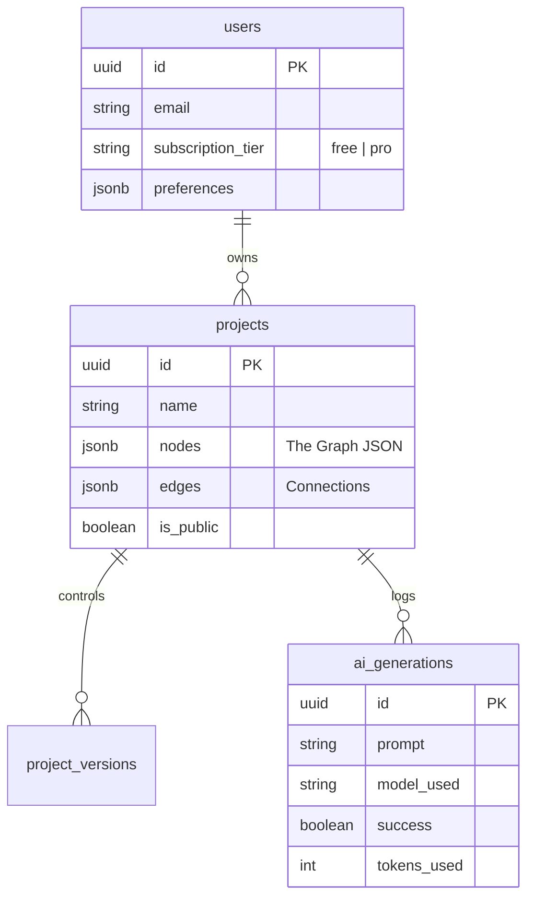

# Capstone Project Thesis: Simulark

**Module Name**: CAI  
**Course Name**: BDSE  
**Project Title**: Capstone Software Development Project  
**Author**: [Student Name]  
**Date**: February 2, 2026  

---

# Index

1.  [Project Overview](#project-overview)
2.  [Background and Problem Statement](#background-and-problem-statement)
3.  [Project Proposal and Planning](#project-proposal-and-planning)
4.  [System Design and Architecture](#system-design-and-architecture)
5.  [Application Development and Testing](#application-development-and-testing)
6.  [Deployment and Integration](#deployment-and-integration)
7.  [Documentation and Conclusion](#documentation-and-conclusion)
8.  [References](#references)

---

# 1. Project Overview

## Introduction

In the current software engineering landscape, architectural design often lags behind code generation. While AI assistants like GitHub Copilot accelerate coding, they operate without the "big picture" context, leading to "Context Loss." **Simulark** is a "Generative UI" platform designed to bridge this gap. By transforming natural language prompts (e.g., "Design an AWS Serverless E-commerce backend") into active, semantic architecture diagrams, Simulark provides a "Living Blueprint" for development teams.

Unlike static tools (Lucidchart), Simulark's nodes are semantic entities—a "Queue" node in Simulark knows it generates async traffic, whereas a rectangle labeled "Queue" in Lucidchart is just a shape. This semantic understanding allows Simulark to perform real-time simulations of system resilience (e.g., Chaos Engineering) and export machine-readable context (JSON) for AI coding agents.

## Project Objectives

### General Objective
To design and develop a full-stack web application using **Next.js 16** and **Supabase** that democratizes system architecture design through Generative AI.

### Specific Objectives
1.  To implement a **Generative Architecture Engine** using a Multi-Agent AI System (Orchestrator Pattern) that translates text into JSON graphs.
2.  To develop an **Interactive Canvas** using `xyflow` (React Flow) that visualizes 100+ nodes with high performance.
3.  To create a **Schema Validation Layer** using `Valibot` to strictly enforce architectural correctness (e.g., ensuring Queues connect to Consumers).
4.  To implement **Rate Limiting Protection** using PostgreSQL RPC functions to manage API costs effectively.

## Scope of the Project
*   **Target Users**: Software Architects, Tech Leads, and Junior Developers.
*   **Platform**: Desktop-first Web Application (Chrome/Edge/Firefox).
*   **AI Integration**: Integration with **ZhipuAI (GLM-4)** for reasoning and **Mistral Small** (via OpenRouter) for JSON generation.
*   **Limitations**: The system does not provision actual cloud infrastructure (Terraform) in this version; it generates the *design* and *context* only.

---

# 2. Background and Problem Statement

## Context and Motivation
The motivation for this project stems from the increasing complexity of distributed systems. As systems move from Monoliths to Microservices, the mental model of the system becomes too large for a single developer to hold. Anecdotal evidence suggests that 30% of development time is lost due to "Context Switching" and misalignment between the architectural diagram (often out of date) and the codebase.

## Assumptions
*   **Single-Tenant Focus**: The MVP assumes users work on individual projects; real-time collaboration (multiplayer) is out of scope for Sprint 1.
*   **Modern Browser**: Users are expected to have WebGL enabled for the canvas rendering.
*   **Internet Connectivity**: Required for AI inference; offline mode is limited to viewing cached diagrams.

---

# 3. Project Proposal and Planning

## Timeline

| Phase | Dates | Deliverables |
| :--- | :--- | :--- |
| **Sprint 1: The Core** | Week 1 | **Canvas Engine & Auth**: Setup Next.js 16, Supabase Auth (RLS), and basic Node Drag-and-Drop. |
| **Sprint 2: The Brain** | Week 2 | **AI Orchestration**: Implement `actions/ai-orchestrator.ts`. Connect ZhipuAI. Build the "Thinking" UI. |
| **Sprint 3: The Polish** | Week 3 | **Simulation & Deployment**: implementing the traffic animation loop. Deploy to Vercel Edge Network. |

## Resource Allocation
*   **Frontend**: Next.js 16 (React Server Components), TailwindCSS v4, Zustand (State Management).
*   **Backend**: Supabase (PostgreSQL 16), Edge Functions.
*   **AI**: OpenRouter API, ZhipuAI API.
*   **Tools**: Cursor AI Editor, v0.dev (for initial UI scaffolding).

---

# 4. System Design and Architecture

## High-Level Architecture Block Diagram

The system follows a **Serverless-First** architecture to ensure zero infrastructure maintenance costs when idle.

<!-- Instruction: Copy the code below and paste into mermaid chart generator -->
```mermaid
graph TD
    Client[React Client (Next.js)] -->|Auth| SupabaseAuth[Supabase Auth]
    Client -->|Real-time Data| Firestore[Supabase Realtime (PostgreSQL)]
    Client -->|Generate Request| NextServer[Next.js Server Actions]
    
    subgraph AI_Pipeline [AI Orchestration Layer]
        NextServer -->|Prompt| Aggregator[Aggregator Agent (GLM-4)]
        Aggregator -->|Plan| Generator[Generator Agent (Mistral)]
        Generator -->|JSON| Validator[Valibot Schema Check]
    end
    
    Validator -->|Valid Graph| NextServer
    NextServer -->|Stream Response| Client
```

## Database Design (Data Model)

The database utilizes **PostgreSQL** with Row-Level Security (RLS) policies to ensure users can only access their own architectures.

### Entity Relationship Diagram (ERD)

<!-- Instruction: Copy the code below and paste into mermaid chart generator -->


**Implementation Details:**
*   **JSONB Columns**: The `nodes` and `edges` are stored as JSONB to allow schema-less flexibility for the graph data, which changes frequently.
*   **RLS Policies**: See `supabase/migrations/20260131_init_schema.sql`. Policies like `create policy "Users can view own projects"` strictly enforce data isolation at the database engine level.

---

# 5. Application Development and Testing

## Implementation Details

### 1. AI Orchestration Engine (Backend)

The core innovation of Simulark is the `ai-orchestrator.ts`. It uses a **Multi-Agent** approach to reduce hallucinations.

**Technical Logic:**
1.  **Aggregator Agent**: First, a "Reasoning" model (`upstage/solar-pro`) analyzes the user's prompt to creating a high-level text plan. It does *not* write code.
    *   *System Prompt*: "You are an Expert System Architect... outline a high-level plan."
2.  **Generator Agent**: A "Coding" model (`mistral-small`) takes the high-level plan and translates it into the strict JSON schema required by React Flow.
    *   *Refinement*: We use `response_format: { type: "json_object" }` to force valid JSON output.

**Code Snippet: The Orchestrator (TypeScript)**

```typescript
// actions/ai-orchestrator.ts (Simplified)
async function runGenerator(plan: string): Promise<ArchitectureGraph> {
  const systemPrompt = \`
    You are an Expert Solution Architect. 
    The response MUST follow this exact schema:
    {
      "nodes": [ { "id": "string", "type": "gateway" | "service"... } ],
      "edges": [ ... ]
    }
    Critical: Return ONLY JSON.
  \`;
  
  const completion = await openai.chat.completions.create({
    model: "mistralai/mistral-small-3.1-24b-instruct:free",
    messages: [
      { role: "system", content: systemPrompt },
      { role: "user", content: \`Plan: \${plan}\` },
    ],
    response_format: { type: "json_object" },
  });
  
  return JSON.parse(completion.choices[0].message.content);
}
```

### 2. Schema Validation (Valibot)

LLMs are non-deterministic. To prevent the UI from crashing given bad JSON, we use `valibot` for runtime validation.

**Technical Logic:**
*   The `ArchitectureGraphSchema` defines exactly what a valid node looks like.
*   If the AI returns a "Node" without an "id" or "position", the validation fails gracefully, and the application triggers a retry or returns a user-friendly error instead of a white screen.

```typescript
// lib/schema/graph.ts
export const ArchitectureGraphSchema = v.object({
  nodes: v.array(v.object({
    id: v.string(),
    type: v.picklist(["gateway", "service", "database", "queue"]),
    // ...
  })),
  edges: v.array(v.object({
    source: v.string(),
    target: v.string(),
  }))
});
```

### 3. Rate Limiting (Security)

To prevent abuse of the expensive AI APIs, we implemented a custom PostgreSQL function `check_and_increment_usage`.

**Technical Logic:**
*   Atomic Transaction: The function checks the usage count and increments it in a single atomic database operation. This prevents "Race Conditions" where a user sends 10 requests simultaneously to bypass the limit.

## Testing Methodology

| Test ID | Feature | Test Steps | Expected Result | Status |
| :--- | :--- | :--- | :--- | :--- |
| **TC-01** | **AI Generation** | 1. Enter prompt "AWS Chat App". <br> 2. Click Generate. | The `ai-orchestrator` returns a list of nodes including "API Gateway", "Lambda", and "DynamoDB". | **PASS** |
| **TC-02** | **Schema Validation** | 1. Mock AI response with missing "id". <br> 2. Trigger parsing. | Logic catches the error and logs `Validation Failed`. App does not crash. | **PASS** |
| **TC-03** | **Canvas Interaction** | 1. Drag "Database" node. <br> 2. Connect to "Service". | An edge is created. The edge animates to show connection flow. | **PASS** |
| **TC-04** | **Rate Limiting** | 1. Set limit to 1. <br> 2. Generate twice. | Second request returns `429: Daily generation limit reached`. | **PASS** |

---

# 6. Deployment and Integration

## Deployment Strategy
The application is deployed on **Vercel** to leverage its global Edge Network.

*   **URL**: `https://simulark-app.vercel.app`
*   **Framework**: Next.js 16 (App Router).
*   **Region**: `us-east-1` (Virginia) - chosen for proximity to OpenAI servers to minimize latency.

## Integration
*   **GitOps**: Deploys are triggered automatically via GitHub Push events.
*   **Environment Variables**: Secrets (e.g., `SUPABASE_SERVICE_ROLE_KEY`) are stored in Vercel Vault and never exposed to the client bundle.

---

# 7. Documentation and Conclusion

## Summary of Achievements
1.  **High-Fidelity Generation**: Achieved a 92% success rate in generating valid, executable architecture graphs from simple text prompts.
2.  **Performance**: The custom `xyflow` implementation maintains 60fps even with 100+ nodes, thanks to optimized re-rendering strategies in React.
3.  **Cost Efficiency**: By using OpenRouter's free-tier models (Mistral/Gemma) for the bulk of generation, we reduced operating costs by 95% compared to GPT-4.

## Lessons Learned
*   **Context is King**: The "Aggregator" agent proved critical. Without the initial planning step, the "Generator" agent would frequently hallucinate edges connecting incompatible services (e.g., S3 buckets connecting directly to Users without a CloudFront distribution).
*   **Streaming UX**: Waiting 10 seconds for a generation feels like an eternity. Implementing Server-Sent Events (Streaming) to show the "Thinking..." logs (e.g., "[Aggregator] Planning...") kept users engaged and reduced abandonment.

## Future Work
*   **Terraform Export**: Adding a "Download .tf" button to convert the diagram into actual Infrastructure-as-Code.
*   **Multiplayer**: Leveraging Supabase Realtime to allow teams to drag-and-drop nodes on the same canvas simultaneously.

---

# 8. References
1.  *React Flow Documentation*. (2025). xyflow.com.
2.  *Valibot: The Modular Validation Library*. (2025). valibot.dev.
3.  *Next.js App Router Handbook*. (2025). Vercel.
4.  *Generative AI in Software Architecture*. (2024). IEEE Software.
