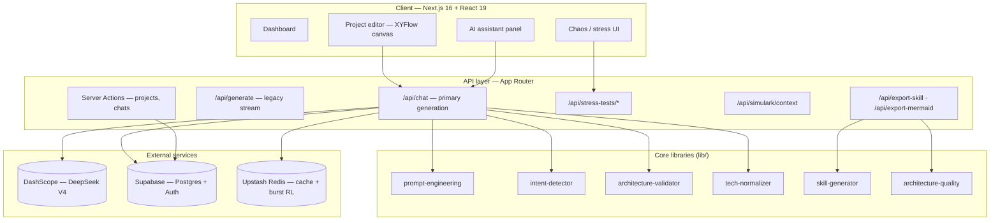
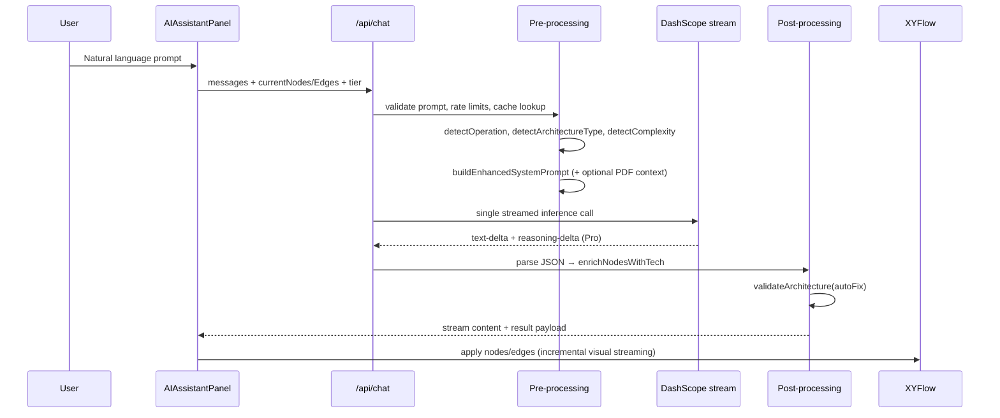
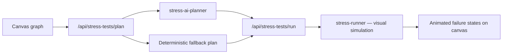

# Simulark

**AI-assisted backend architecture design — free public beta**

Simulark turns plain-English descriptions into interactive architecture diagrams you can edit, validate, stress-test, and export. The canvas is the source of truth: the model proposes structured JSON; deterministic code enforces rules, normalizes tech choices, and renders XYFlow graphs. Inference runs on **DeepSeek V4 Flash / Pro** via Alibaba Cloud DashScope.

---

## Table of contents

- [What it does](#what-it-does)
- [System architecture](#system-architecture)
- [AI generation pipeline](#ai-generation-pipeline)
- [Architecture validation](#architecture-validation)
- [Canvas & node model](#canvas--node-model)
- [Stress & chaos testing](#stress--chaos-testing)
- [Export & IDE bridge](#export--ide-bridge)
- [Inference tiers & resilience](#inference-tiers--resilience)
- [Rate limits & caching](#rate-limits--caching)
- [Data & persistence](#data--persistence)
- [Tech stack](#tech-stack)
- [Project structure](#project-structure)
- [API routes](#api-routes)
- [Testing](#testing)
- [Getting started](#getting-started)
- [Roadmap gaps](#roadmap-gaps)

---

## What it does

| Area | Capabilities |
|------|----------------|
| **Canvas** | 20+ semantic node types on XYFlow, drag-and-drop editing, undo/redo, auto-layout (Dagre flow, hierarchical, radial) |
| **AI assistant** | Chat-driven generation with **Flash** (fast iteration) and **Pro** (deeper reasoning) tiers |
| **Modify existing graphs** | Intent detection (`create`, `modify`, `extend`, `simplify`, `remove`, `optimize`) with current canvas injected into context |
| **Validation** | Rule engine catches anti-patterns (e.g. Next.js + Express, duplicate auth, orphaned DBs) with optional auto-fix |
| **Quality scoring** | Letter grades (A–F) and export gates before Mermaid/skill export |
| **Chaos & stress** | Visual failure simulation on the canvas + AI-assisted stress-test plans |
| **Export** | PNG, SVG, PDF, Mermaid, agent skill ZIP (clipboard + download), REST context for IDEs |
| **Persistence** | Supabase-backed projects, chat history, version snapshots, autosave drafts |
| **Fair use** | Per-user daily caps (Flash/Pro), burst limiting, IP limits via Upstash Redis |

---

## System architecture



### Request flow (architecture generation)



**Design principle:** JSON nodes/edges are the contract — not Mermaid. Mermaid is generated deterministically from the graph at export time.

---

## AI generation pipeline

### Pre-LLM (deterministic)

1. **Auth & quotas** — Supabase session, burst + daily limits, IP cap
2. **Prompt validation** — `validatePrompt()` rejects empty/low-signal input
3. **Cache** — Redis lookup keyed by prompt + canvas size + model + mode
4. **Intent** — `detectOperation()` classifies create vs modify vs simplify, etc.
5. **Detection** — `detectArchitectureType()` and `detectComplexity()` from user text
6. **Tier → mode** — Flash maps to `startup` constraints; Pro maps to `enterprise`
7. **Context assembly** — `buildEnhancedSystemPrompt()` with:
   - Current canvas state (for modifications)
   - Tech validation matrix (binding tech-to-node-type rules)
   - Component count decision tree
   - User preferences (cloud, language, framework)
   - Few-shot examples per mode
   - Optional uploaded PDF project documents

### LLM (single streamed call)

- **Primary path:** `streamDashScopeInference()` via OpenAI-compatible DashScope client
- **Output schema:** JSON with `analysis`, `nodes[]`, `edges[]`, stack recommendations
- **Pro tier:** reasoning stream (`reasoning-delta`) before/alongside JSON
- **Not the main path today:** `lib/diagram-tools.ts` defines agent-style tools (add/connect/validate) for future surgical edits

### Post-LLM (deterministic)

1. **Parse** — Extract JSON from stream (fenced blocks + brace matching + finish fallback)
2. **Normalize** — `enrichNodesWithTech()` maps loose labels to canonical tech IDs
3. **Validate** — `validateArchitecture()` runs rule engine; optional `autoFix`
4. **Cache write** — Store successful payloads in Redis
5. **Client** — `useVisualStreaming()` incrementally renders partial nodes during stream

---

## Architecture validation

`lib/architecture-validator.ts` — explicit rules, typed issues, structured logging.

| Rule | What it catches | Auto-fix |
|------|-----------------|----------|
| No full-stack + backend mix | Next.js/Nuxt/SvelteKit + Express/Fastify/NestJS | Yes — remove backend, reroute edges |
| Duplicate auth | Clerk + Supabase Auth + Firebase Auth, etc. | No |
| Isolated nodes | Orphaned components with no edges | No |
| Database connections | DB with no service source; frontend → DB | No |
| Frontend connections | Frontend with no outgoing edges | No |
| Circular dependencies | Cycles in the graph | No |
| Security without auth | Security node but no auth provider | No |
| Component count | Mode bounds (startup 3–5, default 4–8, enterprise 6–15) | No |
| Enterprise requirements | Missing monitoring/gateway when many services | No |

`lib/architecture-quality.ts` scores graphs (A–F), blocks export on critical issues.

---

## Canvas & node model

Built on **@xyflow/react** with custom nodes in `components/canvas/nodes/`.

| Category | Node types |
|----------|------------|
| **Application** | `frontend`, `backend`, `service`, `client`, `function` |
| **Data** | `database`, `cache`, `vector-db`, `storage`, `queue` |
| **Ingress** | `gateway`, `loadbalancer` |
| **Platform** | `auth`, `security`, `monitoring`, `cicd`, `payment`, `messaging`, `automation` |
| **AI** | `ai`, `ai-model` |
| **Annotations** | `text`, `shape-rect`, `shape-circle`, `shape-diamond` |

**Layout** — `lib/layout.ts` (Dagre flow, hierarchical, radial)  
**State** — Zustand (`lib/store.ts`, `lib/history-store.ts`)  
**Edges** — `SimulationEdge` with protocol labels; fan-in congestion highlighting  
**Schemas** — Valibot per-node configs in `lib/node-schemas.ts`

---

## Stress & chaos testing



- **`lib/stress-testing-plan.ts`** — scenario types: traffic-spike, node-failure, dependency-latency, queue-backlog, data-store-hotspot
- **`lib/stress-ai-planner.ts`** — AI generates scenarios; sanitizes and falls back to rule-based plan on failure
- **`lib/stress-runner.ts`** — drives chaos mode animations on the canvas

---

## Export & IDE bridge

| Export | Mechanism |
|--------|-----------|
| **PNG / SVG / PDF** | `html-to-image`, `jspdf` via `lib/canvas-export.ts` |
| **Mermaid** | `lib/mermaid-export.ts` — deterministic graph → Mermaid; quality gate in `/api/export-mermaid` |
| **Agent skill** | `lib/skill-generator.ts` — [agentskills.io](https://agentskills.io) `SKILL.md` + `references/`; drop into `.agents/skills/{name}/` |
| **IDE context** | `/api/simulark/context` — project summary for Cursor / Claude Code / Windsurf |
| **Terraform** | `lib/terraform-generator.ts` (library; not exposed in main UI yet) |

Skill export flow: `/api/export-skill` returns JSON → client copies `skillMd` to clipboard and builds ZIP via `packageSkill()`.

---

## Inference tiers & resilience

| Tier | DashScope model | Thinking | Architecture mode | Daily limit (default) |
|------|-----------------|----------|-------------------|------------------------|
| **Flash** | `deepseek-v4-flash` | Off | `startup` (3–5 nodes) | 80 |
| **Pro** | `deepseek-v4-pro` | On (`reasoningEffort: high`) | `enterprise` (6–15 nodes) | 25 |

**Fallback chain** (`lib/inference-fallback.ts`):

- Pro → Flash → `qwen3.6-flash`
- Flash → `qwen3.6-flash`

**Resilience** (`lib/deepseek-stream.ts`, `lib/ai-resilience.ts`, `lib/circuit-breaker.ts`):

- Retry on 429/5xx and quota errors
- `parseAIResponse()` with markdown fence stripping
- Circuit breaker for provider health

**Legacy providers** (`lib/ai-client.ts`, `lib/provider-registry.ts`) — Zhipu, Kimi, OpenRouter, NVIDIA still in codebase; primary production path is DashScope.

Internal tasks (e.g. stress planner) use Flash to preserve Pro quota (`INTERNAL_FLASH_MODEL_ID`).

---

## Rate limits & caching

| Layer | Implementation |
|-------|----------------|
| **Daily per-user** | Supabase RPC `check_and_increment_daily_usage` — tier-specific limits |
| **Burst** | Upstash sliding window (`BURST_RATE_LIMIT` / `BURST_RATE_WINDOW_SECONDS`) |
| **IP** | Daily cap for unauthenticated abuse surface |
| **AI response cache** | Redis via `lib/ai-cache.ts` — keyed by prompt + canvas fingerprint |

---

## Data & persistence

**Supabase (PostgreSQL + Auth)**

- `projects` — nodes/edges JSON, metadata, inference tier
- `chats` / `messages` — per-project conversation history
- `project_documents` — optional PDF uploads for RAG-style context
- Daily usage tracking via RPC

**Local draft** — `lib/project-draft.ts` (localStorage autosave between server writes)

---

## Tech stack

| Layer | Technology |
|-------|------------|
| **Framework** | Next.js 16 (App Router), React 19, TypeScript (strict) |
| **Runtime** | Bun |
| **Styling** | Tailwind CSS v4, Radix UI, Framer Motion |
| **Canvas** | @xyflow/react, Dagre |
| **State** | Zustand |
| **Database** | Supabase (PostgreSQL + Auth) |
| **AI (primary)** | DeepSeek V4 via DashScope (OpenAI-compatible SDK) |
| **AI (SDK)** | Vercel AI SDK (`ai`, `@ai-sdk/react`, `@ai-sdk/openai`) |
| **Cache / rate limit** | Upstash Redis (`@upstash/redis`, `@upstash/ratelimit`) |
| **Validation** | Valibot (`env.ts`, API schemas, node schemas) |
| **Env** | `@t3-oss/env-nextjs` |
| **Export** | jszip, jspdf, html-to-image |
| **PDF ingest** | pdf-parse |
| **Lint / format** | Biome |
| **Tests** | Vitest |

---

## Project structure

```
simulark-app/
├── actions/              # Server Actions (projects, chats)
├── app/
│   ├── api/              # Route handlers (chat, export, stress, usage, …)
│   ├── auth/             # Supabase auth flows
│   ├── dashboard/        # Project list
│   └── projects/[id]/    # Canvas editor
├── components/
│   ├── canvas/           # FlowEditor, nodes, edges, AI panel
│   ├── layout/           # Shell, header
│   ├── marketing/        # Landing pages
│   └── ui/               # Shadcn-style primitives
├── lib/                  # Core engineering (see below)
├── supabase/migrations/  # SQL migrations + RLS
├── tests/                # Vitest suites
├── workers/              # Web Workers (if any)
├── env.ts                # Typed environment variables
└── AGENTS.md             # Contributor guide
```

### Key `lib/` modules

| Module | Role |
|--------|------|
| `prompt-engineering.ts` | System prompt builder, architecture detection, mode constraints |
| `intent-detector.ts` | create / modify / simplify / extend / remove / optimize |
| `architecture-validator.ts` | Rule engine + auto-fix |
| `architecture-quality.ts` | Scoring and export gates |
| `tech-normalizer.ts` | Canonical tech ID enrichment |
| `tech-knowledge.ts`, `tech-ecosystem.ts` | Tech matrix and compatibility data |
| `deepseek-stream.ts` | DashScope streaming adapter |
| `inference-tier.ts` | Flash / Pro tier config |
| `skill-generator.ts` | Agent skill export |
| `mermaid-export.ts` | Graph → Mermaid |
| `stress-*.ts` | Stress plan, AI planner, runner |
| `diagram-tools.ts` | Future agent tool definitions |
| `cached-architecture-response.ts` | Redis cache helpers |
| `rate-limit.ts`, `usage-limits.ts` | Quota enforcement |
| `feature-flags.ts` | Feature toggles (all enabled in beta) |

---

## API routes

| Method | Route | Purpose |
|--------|-------|---------|
| `POST` | `/api/chat` | Primary AI architecture generation (stream) |
| `POST` | `/api/generate` | Legacy generation endpoint |
| `POST` | `/api/export-skill` | Agent skill JSON + metadata |
| `POST` | `/api/export-mermaid` | Mermaid export with quality check |
| `POST` | `/api/quality-check` | Architecture quality report |
| `POST` | `/api/stress-tests/plan` | AI / fallback stress scenarios |
| `POST` | `/api/stress-tests/run` | Execute stress simulation |
| `GET/POST` | `/api/projects`, `/api/projects/[id]` | Project CRUD |
| `GET/POST` | `/api/chats`, `/api/chats/[id]/messages` | Chat history |
| `GET` | `/api/usage` | Daily quota snapshot |
| `GET` | `/api/simulark/context` | IDE context export |
| `GET` | `/api/health` | Health check |

---

## Testing

```bash
bun test
```

291 tests across 18 files — validator rules, prompt engineering, skill generator, AI resilience/parsing, inference fallback, stress planner/runner, schema validation, rate-limit helpers, and API route contracts.

---

## Getting started

### Prerequisites

- [Bun](https://bun.sh) v1+
- Supabase project
- DashScope API key (Alibaba Cloud Model Studio)
- Upstash Redis (recommended for production rate limits + AI cache)

### Install

```bash
git clone https://github.com/vins-anity/Simulark-AI.git
cd Simulark-AI
bun install
# Create .env.local from the variables below
bun dev
```

### Environment variables

```env
# Supabase
NEXT_PUBLIC_SUPABASE_URL=
NEXT_PUBLIC_SUPABASE_ANON_KEY=
SUPABASE_SERVICE_ROLE_KEY=

# AI — Alibaba Cloud DashScope (DeepSeek V4)
DASHSCOPE_API_KEY=
DASHSCOPE_WORKSPACE_ID=

# Rate limiting & AI cache (Upstash)
UPSTASH_REDIS_REST_URL=
UPSTASH_REDIS_REST_TOKEN=
FREE_TIER_DAILY_LIMIT=50
FLASH_DAILY_LIMIT=80
PRO_DAILY_LIMIT=25
IP_DAILY_LIMIT=60
BURST_RATE_LIMIT=8
BURST_RATE_WINDOW_SECONDS=60

# Optional: legacy (default) or ui AI SDK message stream
NEXT_PUBLIC_AI_STREAM_FORMAT=legacy

# App
NEXT_PUBLIC_SITE_URL=https://your-app.vercel.app
```

---

## Scripts

```bash
bun dev          # Development server
bun run build    # Production build
bun run lint     # Biome lint
bun run format   # Auto-fix formatting
bun test         # Vitest suite
```

---

## Roadmap gaps

- No paid tiers during public beta (all features enabled via `feature-flags.ts`)
- No Terraform / CloudFormation generation from the UI (library exists)
- No team collaboration or shared workspaces
- No live MCP server — IDE integration via agent skills + REST context
- Agent tool-calling path (`diagram-tools.ts`) not wired to main chat yet
- Surgical graph patches (modify without full regeneration) — planned improvement

---

## License

MIT License.

---

## Acknowledgments

- [XYFlow](https://xyflow.com) — Interactive architecture canvas
- [Supabase](https://supabase.com) — Auth and project persistence
- [DeepSeek](https://www.deepseek.com) / [Alibaba Cloud DashScope](https://www.alibabacloud.com/product/modelstudio) — Inference
- [Upstash](https://upstash.com) — Rate limiting and response cache
- [agentskills.io](https://agentskills.io) — Agent skill export standard
