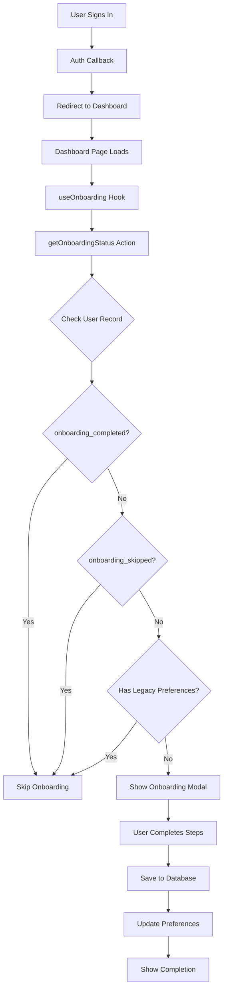
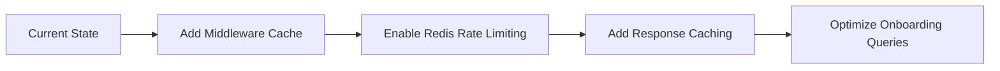

# Production Readiness Audit Report

**Audit Date:** February 13, 2026  
**Version:** 0.1.0  
**Auditor:** Architect Mode

---

## Executive Summary

This audit focuses on production readiness, onboarding flow correctness, and optimization opportunities. The system has solid foundations but has **one critical issue** that will prevent the middleware from working in production.

**Overall Production Readiness: 6/10**

| Category           | Score | Status      |
| ------------------ | ----- | ----------- |
| Middleware/Auth    | 3/10  | 🔴 Critical |
| Onboarding Flow    | 8/10  | 🟢 Good     |
| Environment Config | 7/10  | 🟡 Minor    |
| Database Schema    | 9/10  | 🟢 Good     |
| Security Headers   | 8/10  | 🟢 Good     |
| Rate Limiting      | 7/10  | 🟡 Minor    |

---

## 1. Critical Issue: Middleware Not Configured

### Problem

The project has a [`proxy.ts`](proxy.ts) file that contains middleware logic, but Next.js requires the file to be named `middleware.ts` at the root level.

**Current State:**

```
/proxy.ts          ← Contains middleware logic but wrong filename
/middleware.ts     ← MISSING - Next.js expects this file
```

**Impact:**

- Protected routes (`/dashboard`, `/projects`) are NOT protected
- Rate limiting is NOT applied
- Security headers from middleware are NOT added
- Auth session refresh may NOT work correctly

### Solution

Rename [`proxy.ts`](proxy.ts) to `middleware.ts` and update the export:

```typescript
// Current (proxy.ts)
export async function proxy(request: NextRequest) { ... }

// Should be (middleware.ts)
export async function middleware(request: NextRequest) { ... }
```

**File Changes Required:**

1. Rename `proxy.ts` → `middleware.ts`
2. Rename function `proxy` → `middleware`
3. Keep the `config` export as-is

---

## 2. Onboarding Flow Analysis

### 2.1 Flow Diagram



### 2.2 Onboarding Status Logic

The [`getOnboardingStatus()`](actions/onboarding.ts:26) function correctly checks:

1. **`onboarding_completed`** - If true, user has finished onboarding
2. **`onboarding_skipped`** - If true, user explicitly skipped
3. **Legacy Preferences** - Checks for existing `cloudProviders` or `languages`

**Code Reference:**

```typescript
// actions/onboarding.ts:54-66
const hasExistingPreferences =
  userData?.preferences &&
  typeof userData.preferences === "object" &&
  Object.keys(userData.preferences).length > 0 &&
  ((userData.preferences as UserPreferences).cloudProviders?.length > 0 ||
    (userData.preferences as UserPreferences).languages?.length > 0);

const needsOnboarding =
  !userData?.onboarding_completed &&
  !userData?.onboarding_skipped &&
  !hasExistingPreferences;
```

### 2.3 Onboarding Trigger Points

| Trigger Location             | Implementation Status |
| ---------------------------- | --------------------- |
| Dashboard page load          | ✅ Implemented        |
| URL param `?onboarding=true` | ✅ Implemented        |
| After first sign-in          | ✅ Works via default  |
| Settings page re-onboard     | ⚠️ Not checked        |

### 2.4 Issues Found

#### Minor: No Re-Onboarding from Settings

The settings page should allow users to re-take onboarding, but this needs verification.

**Recommendation:** Add a "Retake Onboarding" button in settings that navigates to `/dashboard?onboarding=true`

---

## 3. Database Schema Verification

### 3.1 Onboarding Fields

The migration [`20260213_add_onboarding.sql`](supabase/migrations/20260213_add_onboarding.sql) correctly adds:

| Column                    | Type        | Default     | Purpose                  |
| ------------------------- | ----------- | ----------- | ------------------------ |
| `onboarding_completed`    | boolean     | false       | Completion flag          |
| `onboarding_step`         | integer     | 0           | Current step 0-3         |
| `onboarding_skipped`      | boolean     | false       | Skip flag                |
| `onboarding_completed_at` | timestamptz | null        | Completion timestamp     |
| `onboarding_data`         | jsonb       | '{}'::jsonb | Partial progress storage |

### 3.2 Index Performance

```sql
-- Efficient partial index for users needing onboarding
create index if not exists idx_users_onboarding
  on public.users(onboarding_completed, onboarding_skipped)
  where onboarding_completed = false and onboarding_skipped = false;
```

✅ **Good:** Partial index reduces index size and improves query performance.

### 3.3 RLS Policies

The users table has correct RLS policies:

- Users can view their own profile ✅
- Users can update their own profile ✅

**Note:** The onboarding fields are in the `users` table, so RLS policies automatically apply.

---

## 4. Environment Configuration

### 4.1 Required Variables

| Variable                        | Required | Status | Notes                          |
| ------------------------------- | -------- | ------ | ------------------------------ |
| `ZHIPU_API_KEY`                 | Yes      | ✅     | Primary AI provider            |
| `NEXT_PUBLIC_SUPABASE_URL`      | Yes      | ✅     | Database URL                   |
| `NEXT_PUBLIC_SUPABASE_ANON_KEY` | Yes      | ✅     | Public key                     |
| `UPSTASH_REDIS_REST_URL`        | Rec.     | ⚠️     | Rate limiting disabled without |
| `UPSTASH_REDIS_REST_TOKEN`      | Rec.     | ⚠️     | Rate limiting disabled without |

### 4.2 Optional Variables

| Variable                | Purpose                  | Default  |
| ----------------------- | ------------------------ | -------- |
| `KIMI_API_KEY`          | Fallback AI provider     | Optional |
| `OPENROUTER_API_KEY`    | Fallback AI provider     | Optional |
| `CRON_SECRET`           | Cron job authentication  | Optional |
| `FREE_TIER_DAILY_LIMIT` | Rate limit for free tier | 10       |

### 4.3 Feature Flags

```typescript
// env.ts:29-36
ENABLE_ALL_FEATURES: default "true"
RESTRICT_FEATURES_BY_TIER: default "false"
```

⚠️ **Warning:** `RESTRICT_FEATURES_BY_TIER` defaults to `false`, meaning all features are enabled for all users. Set to `true` for production if tier restrictions are needed.

---

## 5. Security Analysis

### 5.1 Security Headers (next.config.ts)

✅ **Implemented:**

- `X-DNS-Prefetch-Control: on`
- `X-Content-Type-Options: nosniff`
- `X-Frame-Options: DENY`
- `X-XSS-Protection: 1; mode=block`
- `Referrer-Policy: origin-when-cross-origin`
- `Permissions-Policy: camera=(), microphone=(), geolocation=()`
- `Strict-Transport-Security: max-age=31536000; includeSubDomains`
- `Content-Security-Policy` with proper connect-src

### 5.2 CSP Connect Sources

```
connect-src 'self'
  https://*.supabase.co
  https://open.bigmodel.cn
  https://openrouter.ai
  wss://*.supabase.co
  https://api.simplesvg.com
  https://api.unisvg.com
  https://api.iconify.design;
```

✅ **Good:** All necessary external services are whitelisted.

### 5.3 Rate Limiting

The [`proxy.ts`](proxy.ts:14-44) implements three rate limiters:

| Limiter         | Limit       | Purpose                   |
| --------------- | ----------- | ------------------------- |
| `aiRatelimit`   | 15 req/min  | AI generation endpoints   |
| `apiRatelimit`  | 100 req/min | General API routes        |
| `authRatelimit` | 20 req/min  | Auth-sensitive operations |

⚠️ **Issue:** Rate limiting silently fails if Redis is not configured:

```typescript
// proxy.ts:139-143
} catch (error) {
  logger.error("[Proxy] Rate limit check failed", errorObj, { pathname });
  // Allow request if rate limiting fails
  return { allowed: true };
}
```

**Recommendation:** Consider logging alerts when rate limiting is unavailable.

---

## 6. Optimization Recommendations

### 6.1 Critical Fixes (Do First)

| Priority | Task                                | Impact                |
| -------- | ----------------------------------- | --------------------- |
| P0       | Rename proxy.ts to middleware.ts    | Auth protection works |
| P0       | Rename proxy function to middleware | Middleware executes   |
| P1       | Configure Redis in production       | Rate limiting enabled |

### 6.2 Onboarding Optimizations

| Optimization                       | Current | Proposed            |
| ---------------------------------- | ------- | ------------------- |
| Cache onboarding status in session | No      | Yes, 5-minute cache |
| Preload onboarding step components | No      | Yes, prefetch next  |
| Add re-onboarding in settings      | Missing | Add button          |

### 6.3 Performance Optimizations



**Specific Recommendations:**

1. **Cache onboarding status** - Add a short-lived cache to avoid repeated database queries:

   ```typescript
   // In useOnboarding.ts, add React Query or SWR
   const { data } = useQuery("onboarding-status", getOnboardingStatus, {
     staleTime: 5 * 60 * 1000, // 5 minutes
   });
   ```

2. **Prefetch next step** - While user is on step N, prefetch step N+1 component

3. **Optimize legacy check** - The preferences check could be simplified:
   ```typescript
   // Current: checks multiple conditions
   // Proposed: single JSON path check
   SELECT preferences->'cloudProviders' IS NOT NULL
     OR preferences->'languages' IS NOT NULL as has_preferences
   ```

---

## 7. Production Checklist

### Before Deploy

- [ ] Rename `proxy.ts` to `middleware.ts`
- [ ] Rename `proxy` function to `middleware`
- [ ] Set `UPSTASH_REDIS_REST_URL` environment variable
- [ ] Set `UPSTASH_REDIS_REST_TOKEN` environment variable
- [ ] Set `RESTRICT_FEATURES_BY_TIER=true` if needed
- [ ] Verify `ZHIPU_API_KEY` is set
- [ ] Test onboarding flow end-to-end
- [ ] Test protected routes redirect to sign-in

### After Deploy

- [ ] Verify middleware executes (check headers)
- [ ] Test rate limiting returns 429 when exceeded
- [ ] Monitor onboarding completion rate
- [ ] Check Redis connection in health endpoint

---

## 8. Testing Recommendations

### Manual Test Cases

| Test Case                      | Expected Result                                 |
| ------------------------------ | ----------------------------------------------- |
| New user signs in              | Onboarding modal appears                        |
| User skips onboarding          | Modal closes, can re-trigger                    |
| User completes all steps       | Preferences saved, modal closes                 |
| User navigates to /dashboard   | Redirected to /auth/signin if not authenticated |
| User hits rate limit           | 429 response with retry header                  |
| Existing user with preferences | No onboarding modal                             |

### Automated Tests Needed

```typescript
// Test: Onboarding status detection
describe("getOnboardingStatus", () => {
  it("returns needsOnboarding=true for new user", async () => {
    // New user with no preferences
  });

  it("returns needsOnboarding=false for completed user", async () => {
    // User with onboarding_completed=true
  });

  it("returns needsOnboarding=false for skipped user", async () => {
    // User with onboarding_skipped=true
  });

  it("returns needsOnboarding=false for legacy preferences", async () => {
    // User with cloudProviders/languages in preferences
  });
});
```

---

## 9. Conclusion

### Summary

The Simulark-AI application has a well-designed onboarding system that will work correctly once the middleware issue is fixed. The database schema is properly designed with appropriate indexes and RLS policies.

### Critical Action Required

**Rename `proxy.ts` to `middleware.ts` and rename the exported function from `proxy` to `middleware`.** Without this change, the application will run but:

- Protected routes will be accessible without authentication
- Rate limiting will not work
- Security headers from middleware will not be applied

### Next Steps

1. Fix the middleware naming issue (P0)
2. Configure Redis for production rate limiting (P1)
3. Add re-onboarding option in settings (P2)
4. Implement onboarding status caching (P2)

---

_Report generated by Architect Mode_
