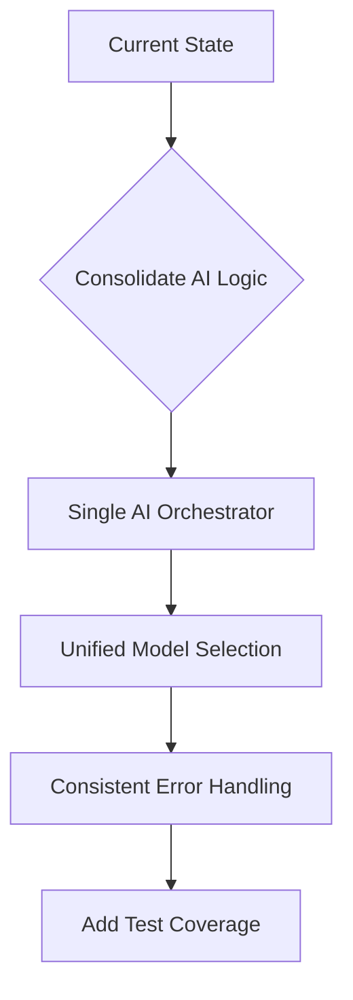
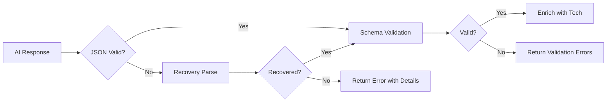

# Simulark-AI System Audit Report

**Audit Date:** February 11, 2026  
**Version:** 0.1.0  
**Auditor:** Architect Mode

---

## Executive Summary

Simulark-AI is an AI-powered backend architecture design platform built with Next.js 16, React 19, and a multi-provider AI system. The platform shows solid architectural foundations with good separation of concerns, but has several areas requiring attention across implementation quality, performance optimization, accuracy improvements, UI/UX enhancements, and feature completeness.

**Overall Health Score: 7/10**

| Category       | Score | Priority |
| -------------- | ----- | -------- |
| Implementation | 7/10  | Medium   |
| Performance    | 6/10  | High     |
| Accuracy       | 7/10  | Medium   |
| UI/UX          | 6/10  | High     |
| Features       | 5/10  | High     |

---

## 1. Implementation Audit

### 1.1 Strengths

- **Type Safety**: Comprehensive TypeScript with strict mode, Valibot schemas for runtime validation
- **Multi-Provider AI**: Robust fallback chain with ZhipuAI, OpenRouter, Kimi, Google, Minimax, Anthropic
- **Resilience Patterns**: Circuit breaker and retry logic in [`lib/circuit-breaker.ts`](lib/circuit-breaker.ts) and [`lib/ai-resilience.ts`](lib/ai-resilience.ts)
- **Clean Architecture**: Separation between actions, API routes, and lib utilities
- **Feature Flags**: Flexible tier-based feature system in [`lib/feature-flags.ts`](lib/feature-flags.ts)

### 1.2 Issues Found

#### Critical Issues

1. **Duplicate AI Orchestration Logic**
   - [`actions/ai-orchestrator.ts`](actions/ai-orchestrator.ts) and [`app/api/generate/route.ts`](app/api/generate/route.ts) both handle AI generation
   - Different models used: orchestrator uses `solar-pro-3` + `mistral-small-3.1`, while generate route uses ZhipuAI
   - **Recommendation**: Consolidate into single source of truth

2. **Missing Test Coverage**
   - [`vitest.config.ts.bak`](vitest.config.ts.bak) indicates tests were disabled
   - No test files found in the project
   - **Recommendation**: Re-enable tests with proper Bun test configuration

#### Medium Issues

3. **Inconsistent Error Handling**
   - Some routes use `console.error`, others use `logger.error`
   - Error codes defined in [`lib/errors.ts`](lib/errors.ts) but not consistently used
   - **Recommendation**: Standardize on logger utility and typed errors

4. **Type Any Usage**
   - Multiple `any` types in [`lib/ai-client.ts:96-97`](lib/ai-client.ts:96) for `currentNodes` and `currentEdges`
   - **Recommendation**: Use proper types from [`lib/schema/graph.ts`](lib/schema/graph.ts)

5. **Dead Code**
   - [`lib/prompt-engineering-old.ts`](lib/prompt-engineering-old.ts) should be removed
   - **Recommendation**: Clean up unused files

### 1.3 Recommendations

---

## 2. Performance Audit

### 2.1 Current State

- **Streaming**: SSE streaming implemented for AI responses
- **Auto-save**: Debounced save in FlowEditor with 1.5s delay
- **Rate Limiting**: Database-backed rate limiting in [`lib/rate-limit.ts`](lib/rate-limit.ts)

### 2.2 Issues Found

#### High Priority

1. **No Caching Layer**
   - AI responses are not cached
   - Identical prompts re-generate from scratch
   - **Recommendation**: Implement Redis caching for repeated prompts

2. **Synchronous Layout Computation**
   - [`lib/layout.ts`](lib/layout.ts) uses Dagre synchronously which blocks main thread
   - Async fallback exists but error handling is complex
   - **Recommendation**: Move layout to Web Worker

3. **No Request Deduplication**
   - Multiple rapid requests for same generation not deduplicated
   - **Recommendation**: Add request deduplication middleware

4. **Large Bundle Size**
   - All node types imported in FlowEditor regardless of usage
   - **Recommendation**: Implement dynamic imports for node components

#### Medium Priority

5. **Database Query Optimization**
   - Rate limit check does 2 separate queries for user tier and usage
   - **Recommendation**: Combine into single query with JOIN

6. **No Pagination for Projects**
   - Project list fetches all projects without pagination
   - **Recommendation**: Add cursor-based pagination

### 2.3 Recommendations

| Issue            | Solution                         | Impact                        |
| ---------------- | -------------------------------- | ----------------------------- |
| No caching       | Add Redis cache for AI responses | 40-60% faster repeat requests |
| Sync layout      | Move to Web Worker               | Non-blocking UI               |
| No deduplication | Add request hash map             | Prevent duplicate work        |
| Large bundle     | Dynamic node imports             | 30-50% smaller initial load   |

---

## 3. Accuracy Audit

### 3.1 Current State

- **Tech Normalization**: [`lib/tech-normalizer.ts`](lib/tech-normalizer.ts) maps AI outputs to consistent IDs
- **Intent Detection**: [`lib/intent-detector.ts`](lib/intent-detector.ts) classifies user operations
- **Schema Validation**: Valibot schemas validate AI JSON outputs

### 3.2 Issues Found

#### High Priority

1. **JSON Parsing Fragility**
   - Multiple fallback strategies in [`app/api/generate/route.ts:159-247`](app/api/generate/route.ts:159)
   - Indicates AI frequently outputs malformed JSON
   - **Recommendation**: Use structured outputs with JSON mode enforced

2. **No Confidence Scoring**
   - Architecture detection returns confidence but it is not used
   - Users not informed when AI is uncertain
   - **Recommendation**: Display confidence scores to users

3. **Tech Normalizer Gaps**
   - Alias list may not cover all AI variations
   - No fallback for unknown tech names
   - **Recommendation**: Add fuzzy matching and logging for unknowns

#### Medium Priority

4. **Prompt Engineering Complexity**
   - [`lib/prompt-engineering.ts`](lib/prompt-engineering.ts) has 400+ lines with complex conditionals
   - Difficult to maintain and debug
   - **Recommendation**: Modularize into separate prompt templates

5. **No Output Validation Feedback**
   - When validation fails, user gets generic error
   - **Recommendation**: Return specific validation errors for retry

### 3.3 Recommendations

---

## 4. UI/UX Audit

### 4.1 Current State

- **Canvas**: XYFlow with 20+ custom node types
- **AI Panel**: Chat interface with thinking visualization
- **Chaos Mode**: Interactive failure simulation
- **Export**: Mermaid, PNG, SVG, PDF options

### 4.2 Issues Found

#### High Priority

1. **No Undo/Redo**
   - Users cannot revert accidental changes
   - Critical for design tools
   - **Recommendation**: Implement history stack with Zustand

2. **No Keyboard Shortcuts**
   - Power users cannot quickly perform actions
   - **Recommendation**: Add keyboard shortcut system

3. **Poor Mobile Experience**
   - Canvas not optimized for touch
   - Sidebar collapses but canvas remains cramped
   - **Recommendation**: Add mobile-specific layout

4. **No Loading States for Nodes**
   - Nodes appear suddenly without animation
   - **Recommendation**: Add skeleton loading and staggered animations

#### Medium Priority

5. **Context Lost on Refresh**
   - Chat history persisted but UI state lost
   - Selected nodes, zoom level not restored
   - **Recommendation**: Persist UI state to localStorage

6. **No Collaborative Features**
   - Single-user only
   - **Recommendation**: Add real-time collaboration with Supabase Realtime

7. **Accessibility Gaps**
   - No ARIA labels on custom nodes
   - Keyboard navigation incomplete
   - **Recommendation**: WCAG 2.1 AA compliance audit

### 4.3 Recommendations

| Feature             | Priority | Effort |
| ------------------- | -------- | ------ |
| Undo/Redo           | Critical | Medium |
| Keyboard Shortcuts  | High     | Low    |
| Mobile Optimization | High     | High   |
| Loading States      | Medium   | Low    |
| State Persistence   | Medium   | Low    |
| Collaboration       | Low      | High   |

---

## 5. Feature Audit

### 5.1 Current Features

| Feature                 | Status      | Notes                         |
| ----------------------- | ----------- | ----------------------------- |
| Architecture Generation | ✅ Complete | Multi-provider with streaming |
| Visual Canvas           | ✅ Complete | 20+ node types                |
| Chaos Mode              | ✅ Complete | Failure simulation            |
| Export                  | ✅ Complete | Mermaid, PNG, SVG, PDF        |
| Context Bridge          | ✅ Complete | .cursorrules, SKILL.md        |
| Chat History            | ✅ Complete | Persisted in Supabase         |
| Subscriptions           | ✅ Complete | 3-tier system                 |
| Code Generation         | ⚠️ Partial  | Marked "coming soon"          |
| Templates               | ❌ Missing  | Page exists but empty         |
| Collaboration           | ❌ Missing  | Not implemented               |
| Version History         | ❌ Missing  | Not implemented               |
| Comments/Annotations    | ❌ Missing  | Not implemented               |

### 5.2 Missing Critical Features

1. **Code Generation**
   - Promised in Pro tier but not implemented
   - Terraform generator exists in [`lib/terraform-generator.ts`](lib/terraform-generator.ts) but not exposed
   - **Recommendation**: Prioritize for Pro tier value proposition

2. **Templates System**
   - [`app/dashboard/templates/page.tsx`](app/dashboard/templates/page.tsx) exists but empty
   - [`lib/templates.ts`](lib/templates.ts) has template definitions
   - **Recommendation**: Connect templates to UI

3. **Version History**
   - No way to revert to previous architecture versions
   - **Recommendation**: Add version snapshots

### 5.3 Feature Flag Inconsistencies

- [`lib/feature-flags.ts`](lib/feature-flags.ts) and [`lib/subscription.ts`](lib/subscription.ts) both define tier features
- Different models listed in each file
- **Recommendation**: Single source of truth for tier features

---

## 6. Security Audit

### 6.1 Current State

- **Authentication**: Supabase Auth with RLS policies
- **Rate Limiting**: Database-backed with tier limits
- **API Keys**: Server-side only, not exposed to client

### 6.2 Issues Found

1. **No Input Sanitization**
   - User prompts passed directly to AI
   - Potential for prompt injection
   - **Recommendation**: Add input sanitization layer

2. **No CSRF Protection**
   - API routes do not implement CSRF tokens
   - **Recommendation**: Add CSRF middleware

3. **Debug Information Leakage**
   - Error messages include internal details
   - **Recommendation**: Sanitize error messages for production

---

## 7. Priority Roadmap

### Phase 1: Critical Fixes

- [ ] Consolidate AI orchestration logic
- [ ] Add undo/redo functionality
- [ ] Implement code generation for Pro tier
- [ ] Add test coverage

### Phase 2: Performance

- [ ] Add Redis caching for AI responses
- [ ] Move layout computation to Web Worker
- [ ] Implement request deduplication
- [ ] Add dynamic imports for nodes

### Phase 3: UX Improvements

- [ ] Add keyboard shortcuts
- [ ] Implement state persistence
- [ ] Add loading states and animations
- [ ] Mobile optimization

### Phase 4: Feature Completion

- [ ] Connect templates to UI
- [ ] Add version history
- [ ] Implement collaboration features
- [ ] Add comments/annotations

---

## 8. Metrics to Track

| Metric             | Current | Target |
| ------------------ | ------- | ------ |
| Test Coverage      | 0%      | 80%    |
| AI Response Time   | ~15s    | <10s   |
| JSON Parse Success | ~85%    | 98%    |
| Bundle Size        | Unknown | <500KB |
| Lighthouse Score   | Unknown | 90+    |

---

## 9. Conclusion

Simulark-AI has a solid foundation with good architectural patterns, but requires attention in several areas:

1. **Immediate**: Consolidate duplicate AI logic, add tests, implement undo/redo
2. **Short-term**: Performance optimization with caching and Web Workers
3. **Medium-term**: Complete missing features like code generation and templates
4. **Long-term**: Add collaboration and advanced features

The codebase is well-structured and maintainable, making these improvements achievable with focused effort.

---

_Report generated by Architect Mode_
